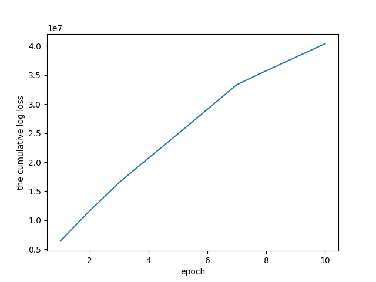
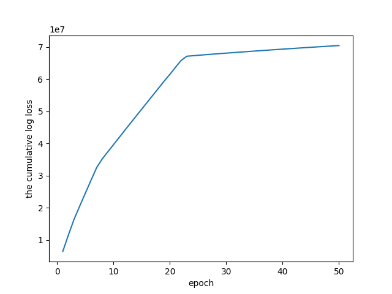

## 28th of March 2021

> First, understand the format of COCA spoken text

1. each line starts with a label for a certain source.
  - e.g. @@4172426 
  - e.g. @@4172430 
2. each utterance is conveniently tagged with the speaker of the utterance.
  - e.g. @!TERRY-GROSS# Andy Greenberg is ...
  - e.g. @!DAVE-DAVIES# So let 's talk about what 's in 
3. profanities are censored with `@ @ @ @ @ @ @ @ @ @` (always 10 of them).
  - e.g. The individual mandate was meant @ @ @ @ @ @ @ @ @ @ for making that decision.
  - e.g. , and @ @ @ @ @ @ @ @ @ @ . Or , you know , that typically means higher deductibles and higher co-payments.
4. Punctuations are delimited with space.
  - e.g. ealth insurance . The subsidies u
  - e.g. Obamacare enrollees ? Could they af
  - e.g. one who is 64 , right no


> Can you exploit any of them?

1. the labels
 - Maybe useful if I want to retrieve examples and want to show the source. But as far as idiom2vec project
 - this comes in handy for parallel processing! you know exactly how to split the corpus up.
is concerned, I don't need them.
2. speaker segmentation.
 - might be useful for chatbot. But not really for me. I'll just use sliding windows.
3. profanities
 - could be a useful information. encode that with `[profanity]`. 
4. Punctuations. 
 - May not really be useful, I think. Ignore this part. 


## 29th of March 2021

> How do I optimize hyperparameters for Word2Vec?

How many epochs should I do? Would visualising the loss help?


I had set the epoch to 10, and this was the result:


hyper parameters for the graph above:
```python
PARAMS = {
    'vector_size': 100,
    'window': 10,
    'min_count': 1,
    'workers': 5,
    'sg': 1,  # use skipgram
    'epochs': 10,  # number of iterations.
    'compute_loss': True  # want to have a look at the loss
}
```


You should either increase the learning rate, or... 
increase the epoch size.

Let's try 50 epochs.

with 50 epochs, and with the same values for other hyper parmas, we get:


Okay, so optimizing epochs is important. (gradient steps.).


How does the model (v: 0.0.1) perform? 

here are some examples. 

First, top 30 nearest neighbours to *catch-22*:
```text
mockingbird 0.846593976020813
blurb 0.7274305820465088
heady 0.7145246267318726
McGowan 0.6060003042221069
STEPHEN 0.5927042365074158
Disgrace 0.5844409465789795
Gunslinger 0.5816043615341187
optione 0.5808339715003967
Fortier 0.5619481205940247
2:26 0.561066746711731
malevolence 0.5591676831245422
disenchantment 0.5511950850486755
Stick 0.5503585934638977
Sandman 0.5494344830513
gnu 0.5482770800590515
spanking 0.5407834053039551
verbiage 0.5344424843788147
Python 0.5328793525695801
Milano 0.5297505855560303
artform 0.5255012512207031
Kohanikoa 0.525132954120636
creamsicle 0.5239585041999817
COLBERT 0.5236631035804749
Grazer 0.5228258371353149
Shmuley 0.5200979709625244
funny 0.5200240612030029
H.L. 0.519676148891449
Kambree 0.5190245509147644
Tyrannosaurus 0.5185222029685974
Rabbi 0.5180768370628357
```
mockingbird? does that even relate to catch-22?

Apaarently, it does! - https://erupprecht.wordpress.com/2014/04/05/caught-up-in-catch-22/
- "So while Mockingbird was teaching us lessons about becoming moral, upright young people,
  Catch-22 was schooling us about being skeptical 
  and questioning authority and suspecting people’s motives and seeing life through a corrective lens of irony."
  

**blurb** also kind of makes sense. Catch-22 situation is blurry. You can't come up with a clear plan to get out of it
right away.


as for "as long as" and "you name it":
```text
###as long as
curvy 0.5538508892059326
24:16 0.5279868245124817
24:19 0.5275934934616089
Moor 0.526692807674408
sturdy 0.5156881809234619
jawline 0.5061637163162231
14:10:13 0.49112531542778015
chokehold 0.4875207245349884
siphon 0.48191559314727783
shmight 0.48048242926597595
circle the wagons 0.4798296093940735
spectrophilia 0.4797925055027008
wallow 0.47773924469947815
-lpn 0.47649553418159485
prat 0.4730754792690277
Fall 0.4722538888454437
fantasty 0.46990111470222473
01:50:00 0.46963149309158325
wrongheade 0.46956199407577515
audit 0.4692993760108948
trickiness 0.46316853165626526
pro 0.46161550283432007
preserver 0.46094486117362976
unjustly 0.4592549502849579
promulgation 0.4551284611225128
Mara 0.45480120182037354
15:25:07and 0.4535512626171112
technically 0.45197156071662903
realignment 0.45109450817108154
trillion- 0.45076754689216614

###you name it
crisscross 0.5858334898948669
gooseberry 0.5526860356330872
36:11 0.5420896410942078
Pergola 0.5144903659820557
Peeples 0.4617049992084503
36:07 0.4599993824958801
KAMAU 0.4550372064113617
36:09 0.4530431032180786
Baptist 0.4511703848838806
BELL 0.4427003562450409
screenwrite 0.44157156348228455
Baidwan 0.4401493966579437
Sanjeet 0.43733131885528564
reputational 0.4359336495399475
Chicagoan 0.43570294976234436
Thorpe 0.4348847568035126
00:05:09 0.4343339800834656
watering 0.43375450372695923
-Rancher 0.43133974075317383
Tug 0.4290827810764313
Toots 0.428454726934433
trodden 0.42670583724975586
Merica 0.42670518159866333
@!JAPAN'S 0.4257393479347229
BABE 0.4253920316696167
Ontario 0.4237334728240967
Viggo 0.42328235507011414
Tupper 0.42256754636764526
Mortensen 0.42186954617500305
reliability 0.42113417387008667

```

hmm... don't know about that.
Hey, maybe I could use pretrained word2vec to continue training mine? 

yes, you could, but let's leave that for the next iteration. For now, just use this premature model.

what next? go back to idiomify project. Now, build an idiom classifier.
Build a training set first. (definition, embedding) pairs.


For that, we will need a pretrained bert.
Go have a look. How you could use pretrained ones to train yours.


## 11st of April, 2021

as for each version, we save three files. 
1. idiom2vec_$$$.model
  - we are keeping this so that we can see which words are similar to 
   a given idiom.
2. idiom2vec_light_$$$.kv  -> this only saves the vectors for the idioms.
  - we are saving this so that we can evaluate idiomifier much faster.
3. idiom2vec_$$$.log
  - we are saving this so that we can parse it and thereby plot the loss-over-epoch
   graph.
   

what is your next goal? The next goal is to...
1. count the occurrences of idioms, and plot it.
  - this will be used as an evaluation metric for the
  sufficiency of the data.
2. save `idiom2vec_light_$$$.kv` in resources, version-control it.
  - this shouldn't be a huge hassle. 
3. Implement `most_similar_idioms_by_key`, `most_similar_idioms_by_vector`
  - most urgently need the later one.
  - this gets use of `idiom2vec_light_$$$.kv`. 
  - this operation must be fast.

pretrained weights를 활용하는 건. 나중에 해보자구. 제일 마지막에 해볼 것.

일단... 사용할 pretrained weights에 맞추어서. 임베딩의 크기를 정하자. 그게 나을듯 싶다.

Okay, so what is it that you want to do now?
You want to submit a job. That's what you want.

주체적인 수학자가 목표. proactive mathematician.

So, what's your plan now? 

1. sync coca_spok data. (from server to local): done
   - why? so that we can test them on local.
2. complete build_coca_mag.sh.: done
   - make sure you check eta.
3. refactoring: cleansers.
   - domain-specific cleansing.
4. submit job on the server. (workers=12)
In the meanwhile, we work on the training script.
   
Important:
- https://datascience.stackexchange.com/questions/8753/what-is-a-better-input-for-word2vec
- Should each document = sentence? or should each be individual sentences?
- document = sentence -> more focus on the meaning of words  -> 너가 원하는 것은 여기에
- document = article, or a paragraph -> window large -> more 
  - 수학적인 이유? 이 문서에 대하여 loss를 구해서? 그건 context window 아닌가? 이게 궁금하다.

Oh man. This whole time you've been ignoring that, when this could have been a great thing to experiment on.
Something like that. You may want to see if sentence vs. document would be of help in anyways.

Okay, so as for tonight, you need to tokenize them into sentences!
일단... 음... you need to split them up. Ah, data processing yet again.

아, 이거 골치아프네. 일단 지금은 훈련에 집중해보자.
complete을 하긴 해야함.
sentence로 split하는 스크립트만 일단 째보자.


1분에 200000 짜리 스플릿을 10개처리 가능한 성능임.
이정도면 페이스면,  3732개니까.
373분. 대략 6시간정도 소요예정이라는 소리....허허. 뭐, 하루종일 걸리는 것보단 나으니까!
켜놓고 자면 되겠지 뭐. 그렇게 생각하자.

그게 그정도.


idiom2vec_001.model에서, most similar를 해봄.
```commandline
# --- idioms similar to american dream --- #
land_of_opportunity 0.4797023832798004
forbidden_fruit 0.46736130118370056
matter_of_course 0.4377642869949341
love_of_one's_life 0.430107444524765
pain_and_suffering 0.4248839318752289
move_the_goalposts 0.4180717468261719
offer_one's_condolences 0.41583359241485596
heart-breaking 0.4144800007343292
play_it_safe 0.4144169092178345
under_the_table 0.409618616104126
```

land of opportunity! That's interesting.


## 14th of April

기존의 스플릿부터 시작할 수 있도록 함.

ssh가 자꾸 꺼지는 이유를 알았다.
- https://stackoverflow.com/questions/25084288/keep-ssh-session-alive
